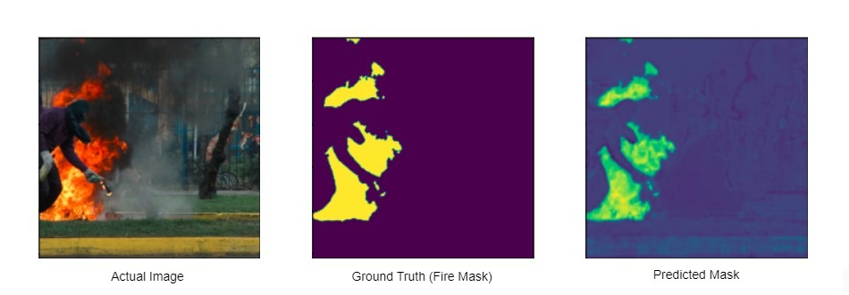
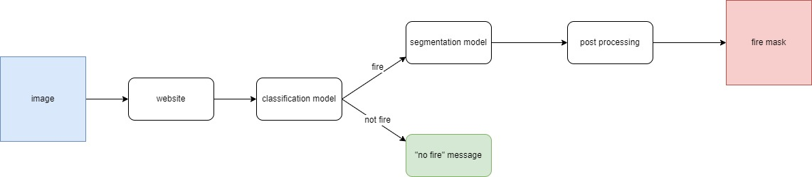
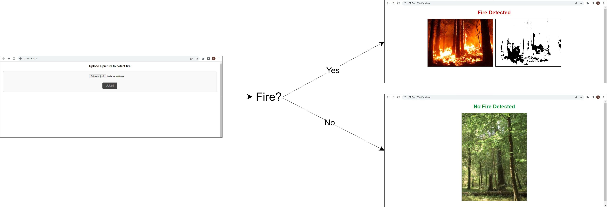

# fire_segmentation



Neural networks course project. Website to segment fire from image 
in case it contains it. Uses `resnet` for classification 
and `unet` for segmentation. The main idea is to get information
whether given image pictures fire and in case the answer is
positive - get image with segment highlighted.



For demonstration of our models we created a simple web
application using `flask`. User can load image from their 
file system and observe the result - message or mask



### **1. SETTING UP PROJECT**
- Clone project `git clone <link>`
- Configure virtual environment (example for PyCharm IDE is below)
- Install requirements `pip install -r requirements.txt`
- Download trained models (from [Google Drive](https://drive.google.com/drive/folders/1aSTjtXbVzl8ns48yK4-uO8dzx4ggbZm2?usp=sharing))
- Put models into `models` dir
- Create `image_edition` dir in root of the project

### **2. RUN APP**
- open terminal inside `venv`
- run start script:
    ```bash
    python app.py
    ```

### **3. ADDITIONAL**
**Configure virtual environment (PyCharm)**
- Open in project PyCharm
- Open `Settings` (Ctrl + Alt + S)
- Click on `Project: neural_networks_course_project`
- Click on `Python Interpreter`
- Click on settings icon
- Click on `Add...`
- Configure environment
- Run `pip install -r requirements.txt`

**Useful commands**
- freeze requirements `pip freeze > requirements.txt`
