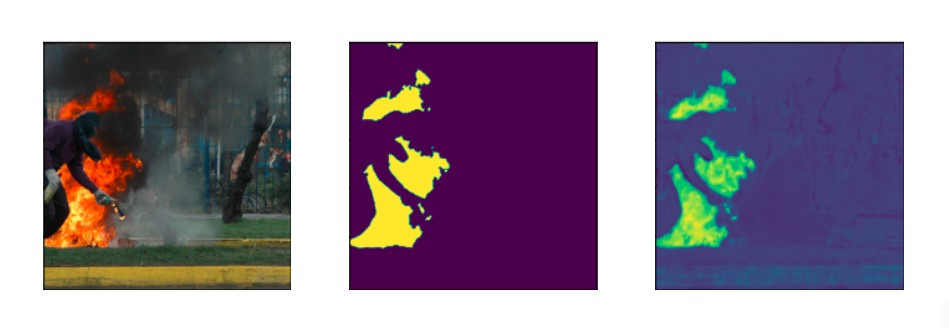

# fire_segmentation

**SETTING PROJECT UP GUIDE**
- Clone project `git clone <link>`
- Configure virtual environment (example for PyCharm is below)
- Install requirements `pip install -r requirements.txt`

**Configure virtual environment (PyCharm)**
- Open in project PyCharm
- Open `Settings` (Ctrl + Alt + S)
- Click on `Project: neural_networks_course_project`
- Click on `Python Interpreter`
- Click on settings icon
- Click on `Add...`
- Configure environment
- Run `pip install -r requirements.txt`

**Useful commands**
- freeze requirements `pip freeze > requirements.txt`
